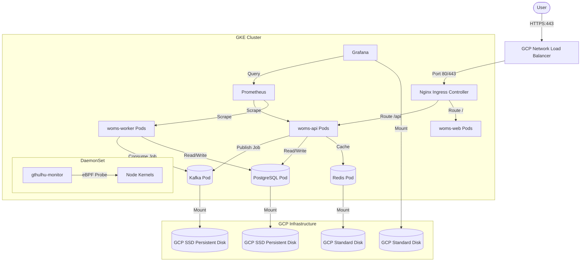

# WOMS GCP Migration Plan

[繁體中文](file:///c:/Users/Alen%20Chen/Desktop/WMOS/WOMS/Plan.zh-TW.md) | [English](file:///c:/Users/Alen%20Chen/Desktop/WMOS/WOMS/Plan.md)

This document provides a comprehensive migration plan to move the Wafer Order Management and Scheduling (WOMS) system from the local development/testing environment to **Google Cloud Platform (GCP)** under a strict **$200/month budget**.

To satisfy all architectural constraints—specifically enabling the eBPF-based `gthulhu` monitor, provisioning a Load Balancer, enforcing HTTPS, and ensuring persistent, highly reliable data storage—the system will be deployed on a **GKE Standard** cluster utilizing a hybrid node pool setup (Standard + Spot instances).

---

## 1. Existing Helm Deployment Analysis

Currently, WOMS is packaged as an umbrella Helm chart (`deploy/helm/woms`) containing the following core workloads and local-configured resources:

1. **Stateless Workloads**:
   - `woms-web` (Frontend): 2 replicas (Requests: 50m CPU, 64Mi RAM; Limits: 200m CPU, 128Mi RAM).
   - `woms-api` (Go API): 2 replicas (Requests: 100m CPU, 128Mi RAM; Limits: 500m CPU, 512Mi RAM).
   - `woms-worker` (Go Scheduler Worker): Scaled via KEDA from 1 to 10 replicas (Requests: 100m CPU, 128Mi RAM; Limits: 1000m CPU, 512Mi RAM).
2. **Stateful Workloads** (dependencies via Bitnami Helm charts):
   - `postgresql`: 1 replica (Requests: 100m CPU, 256Mi RAM; Limits: 500m CPU, 512Mi RAM).
   - `redis`: 1 replica (Requests: 50m CPU, 128Mi RAM; Limits: 250m CPU, 256Mi RAM).
   - `kafka`: 1 replica (Requests: 100m CPU, 512Mi RAM; Limits: 1000m CPU, 1Gi RAM).
3. **Monitoring Stack**:
   - `prometheus`: 1 replica (Scrapes metrics from API and worker).
   - `grafana`: 1 replica (Requests: 50m CPU, 128Mi RAM; Limits: 250m CPU, 256Mi RAM).
4. **Ingress & Autoscaling**:
   - Nginx Ingress Controller (controls routing).
   - KEDA (Kubernetes Event-driven Autoscaling) using Kafka lag and CPU triggers.
5. **Gthulhu (BPF Monitor)**:
   - A daemonset currently disabled in local values but required in production. It deploys BPF probes to node kernels to monitor context switches and wait times.

---

## 2. Target GCP Architecture



### 2.1 Component Mapping & Configuration
* **GKE Standard Cluster**: Standard cluster is selected instead of Autopilot. GKE Autopilot blocks privileged containers (`securityContext.privileged: true`) and restricts mounting `/sys/kernel/debug` or loading custom BPF programs on the host nodes, which would completely disable `gthulhu`'s eBPF probes.
* **Hybrid Node Pools**:
  * **Pool A (Stateful - 1x standard node)**: Uses 1x non-preemptible `e2-standard-2` (2 vCPUs, 8 GB RAM) VM. This node is tainted for stateful workloads. PostgreSQL, Kafka, and Redis are explicitly pinned here via `nodeSelector` / `tolerations` to prevent data volatility or cluster instability during node preemption.
  * **Pool B (Stateless - 2x Spot nodes)**: Uses 2x Spot `e2-standard-2` (2 vCPUs, 8 GB RAM) VMs. This runs the `api`, `web`, `worker`, `prometheus`, `grafana`, KEDA operators, and Nginx Ingress. If a node is preempted, pods are seamlessly rescheduled onto the remaining spot nodes.
* **Data Consistency & Reliability**:
  * Persistent storage relies on Google Cloud **Persistent Disks (PD)**. Since database and broker pods are stateful, their data is written to dedicated PDs that exist independently of the VM node's lifecycle.
  * SSD Persistent Disks (`pd-ssd` or `pd-balanced`) are used for PostgreSQL and Kafka to ensure high write throughput and stability.
  * Standard Persistent Disks (`pd-standard`) are used for Redis and Grafana.
  * *Backup strategy*: Configure GCP VM/disk snapshot schedules to perform nightly backups of PostgreSQL and Kafka volumes.
* **Load Balancer & HTTPS**:
  * The Nginx Ingress Service will be exposed via `type: LoadBalancer`. In GKE, this automatically spins up a Google Cloud Network Load Balancer (passthrough L4 external load balancer).
  * HTTPS termination is handled by Nginx Ingress. **Cert-Manager** will be installed in the cluster to automatically provision and renew SSL certificates via Let's Encrypt using ACME DNS-01 or HTTP-01 challenges.

---

## 3. Estimated Monthly Budget Breakdown (us-central1 Region)

To ensure the deployment remains strictly under the $200 monthly ceiling, we utilize GKE's free tier and GCP's Spot VM discounts.

| Component | GCP Resource | Pricing Details | Est. Monthly Cost |
| :--- | :--- | :--- | :--- |
| **Cluster Management** | GKE Standard Fee | $0.10/hour ($73.00/mo) - Covered by GKE Free Tier | **$0.00** |
| **Stateful Node** | 1x `e2-standard-2` (Regular) | 2 vCPUs, 8 GB RAM (runs PostgreSQL, Redis, Kafka, Gthulhu) | **$48.91** |
| **Stateless Node Pool** | 2x `e2-standard-2` (Spot) | 2 vCPUs, 8 GB RAM each (runs Web, API, Worker, KEDA, Prometheus) | **$29.34** |
| **Persistent Storage** | GCP SSD & Standard PD | 2x 10GB SSD PD (Postgres, Kafka) + 2x 5GB Standard PD (Redis, Grafana) | **$3.80** |
| **Load Balancer** | L4 External TCP/UDP LB | Created by Nginx Ingress Service | **$18.00** |
| **Outbound Gateway** | Cloud NAT Gateway | Needed for private node outbound API/Docker Hub access | **$1.50** |
| **Container Registry** | Artifact Registry | Build image storage (~2GB) | **$0.20** |
| **Network Egress** | Outbound Traffic | Staging traffic egress (estimated ~40GB/mo) | **$5.00** |
| **Total Estimated Cost** | | | **~$106.75 / month** |

> [!NOTE]
> GKE Standard charges a flat $0.10/hour cluster management fee, but Google automatically applies a **$74.40/month credit** per billing account, making one single cluster management fee effectively free ($0.00).
> If the scheduler worker scales up to its max replica count of 10 under peak Kafka queue lag, GKE's cluster autoscaler will provision additional spot nodes temporarily. Scaling up by 2 extra spot nodes for 10 hours a week will only add ~$1.60 to the monthly cost, keeping the budget well below $200.

---

## 4. Execution Step-by-Step Plan

### Step 1: Pre-requisites & Local Configurations
1. Build the production Docker images locally or through GitHub Actions:
   - API: `docker.io/d11nn/woms-api:<tag>`
   - Worker: `docker.io/d11nn/woms-scheduler-worker:<tag>`
   - Web: `docker.io/d11nn/woms-web:<tag>`
2. Publish them to Docker Hub (or GCP Artifact Registry).

### Step 2: Set up GCP Network & Security
Run the following GCP CLI commands to configure a VPC, private subnet, and Cloud NAT (so GKE nodes are secure/private but can still pull images):

```bash
# 1. Create custom VPC network
gcloud compute networks create woms-vpc --subnet-mode=custom

# 2. Create private subnet
gcloud compute networks subnets create woms-gke-subnet \
    --network=woms-vpc \
    --region=us-central1 \
    --range=10.10.0.0/20 \
    --enable-private-ip-google-access

# 3. Create Cloud Router (dependency for Cloud NAT)
gcloud compute routers create woms-router \
    --network=woms-vpc \
    --region=us-central1

# 4. Create Cloud NAT configuration
gcloud compute routers nats create woms-nat \
    --router=woms-router \
    --region=us-central1 \
    --auto-allocate-nat-external-ips \
    --nat-custom-subnet-ip-ranges=woms-gke-subnet
```

### Step 3: Create the GKE Standard Cluster
Provision the cluster with a default (tainted) standard node pool for stateful services, then add the spot node pool:

```bash
# 1. Create cluster with standard stateful pool
gcloud container clusters create woms-cluster \
    --region=us-central1 \
    --node-locations=us-central1-a \
    --num-nodes=1 \
    --machine-type=e2-standard-2 \
    --network=woms-vpc \
    --subnetwork=woms-gke-subnet \
    --enable-ip-alias \
    --enable-private-nodes \
    --master-ipv4-cidr=172.16.0.0/28 \
    --node-taints=workload=stateful:NoSchedule \
    --node-labels=workload=stateful

# 2. Add Spot node pool for stateless services
gcloud container node-pools create stateless-pool \
    --cluster=woms-cluster \
    --region=us-central1 \
    --num-nodes=2 \
    --machine-type=e2-standard-2 \
    --spot \
    --enable-autoscaling --min-nodes=1 --max-nodes=5 \
    --node-labels=workload=stateless
```

### Step 4: Install System Dependencies (Ingress & Cert-Manager)
Connect to the cluster and install the Nginx Ingress Controller and Cert-Manager via Helm:

```bash
# Get credentials
gcloud container clusters get-credentials woms-cluster --region=us-central1

# Add helm repositories
helm repo add ingress-nginx https://kubernetes.github.io/ingress-nginx
helm repo add jetstack https://charts.jetstack.io
helm repo update

# Install Ingress-Nginx on the stateless node pool
helm upgrade --install ingress-nginx ingress-nginx/ingress-nginx \
    --namespace ingress-nginx --create-namespace \
    --set controller.nodeSelector.workload=stateless

# Install Cert-Manager
helm upgrade --install cert-manager jetstack/cert-manager \
    --namespace cert-manager --create-namespace \
    --set installCRDs=true \
    --set nodeSelector.workload=stateless
```

### Step 5: Configure Storage Classes & Let's Encrypt Issuer
Create a storage configuration file `gcp-storageclasses.yaml` to register GCP persistent disks:

```yaml
apiVersion: storage.k8s.io/v1
kind: StorageClass
metadata:
  name: pd-ssd
provisioner: pd.csi.storage.gke.io
volumeBindingMode: WaitForFirstConsumer
parameters:
  type: pd-ssd
---
apiVersion: storage.k8s.io/v1
kind: StorageClass
metadata:
  name: pd-standard
provisioner: pd.csi.storage.gke.io
volumeBindingMode: WaitForFirstConsumer
parameters:
  type: pd-standard
```
Apply it: `kubectl apply -f gcp-storageclasses.yaml`

Create the Let's Encrypt ClusterIssuer configuration `cluster-issuer.yaml` to issue SSL certificates:

```yaml
apiVersion: cert-manager.io/v1
kind: ClusterIssuer
metadata:
  name: letsencrypt-prod
spec:
  acme:
    server: https://acme-v02.api.letsencrypt.org/directory
    email: admin@woms.company.com  # Change to system administrator email
    privateKeySecretRef:
      name: letsencrypt-prod
    solvers:
    - http01:
        ingress:
          class: nginx
```
Apply it: `kubectl apply -f cluster-issuer.yaml`

### Step 6: Deploy WOMS Helm Chart
To deploy WOMS on GKE Standard, we customize `values.yaml` to align workloads to their correct node pools and persistence engines. Prepare a new `values-gcp.yaml` file:

```yaml
global:
  imagePullPolicy: IfNotPresent

imageRegistry: docker.io/d11nn

api:
  replicaCount: 2
  image:
    tag: v0.1.41
  resources:
    requests:
      cpu: 100m
      memory: 128Mi
    limits:
      cpu: 500m
      memory: 512Mi
  nodeSelector:
    workload: stateless

worker:
  replicaCount: 1
  image:
    tag: v0.1.41
  resources:
    requests:
      cpu: 100m
      memory: 128Mi
    limits:
      cpu: 1000m
      memory: 512Mi
  nodeSelector:
    workload: stateless

web:
  replicaCount: 2
  image:
    tag: v0.1.41
  resources:
    requests:
      cpu: 50m
      memory: 64Mi
    limits:
      cpu: 200m
      memory: 128Mi
  nodeSelector:
    workload: stateless

ingress:
  enabled: true
  className: nginx
  host: woms.gcp.yourcompany.com   # Point your DNS A record to the Ingress Load Balancer IP
  annotations:
    cert-manager.io/cluster-issuer: letsencrypt-prod
  tls:
    enabled: true
    secretName: woms-tls-prod

keda:
  enabled: true
  minReplicaCount: 1
  maxReplicaCount: 10
  # KEDA operators run on stateless
  operator:
    nodeSelector:
      workload: stateless

gthulhu:
  enabled: true  # Enabled as requested!
  scheduler:
    image:
      tag: "v0.1.0"
  # Deploy monitor daemonset onto all nodes to gather eBPF kernel scheduler telemetry
  daemonset:
    tolerations:
      - key: "workload"
        operator: "Equal"
        value: "stateful"
        effect: "NoSchedule"

postgresql:
  enabled: true
  fullnameOverride: postgres
  global:
    storageClass: pd-ssd  # Mount highly reliable SSD PD
  primary:
    persistence:
      size: 10Gi
    resources:
      requests:
        cpu: 100m
        memory: 256Mi
      limits:
        cpu: 500m
        memory: 512Mi
    nodeSelector:
      workload: stateful
    tolerations:
      - key: "workload"
        operator: "Equal"
        value: "stateful"
        effect: "NoSchedule"

redis:
  enabled: true
  fullnameOverride: redis
  master:
    persistence:
      storageClass: pd-standard  # Mount standard PD
      size: 5Gi
    resources:
      requests:
        cpu: 50m
        memory: 128Mi
      limits:
        cpu: 250m
        memory: 256Mi
    nodeSelector:
      workload: stateful
    tolerations:
      - key: "workload"
        operator: "Equal"
        value: "stateful"
        effect: "NoSchedule"

kafka:
  enabled: true
  fullnameOverride: kafka
  controller:
    replicaCount: 1
    persistence:
      storageClass: pd-ssd  # Mount SSD PD for broker logs
      size: 10Gi
    resources:
      requests:
        cpu: 100m
        memory: 512Mi
      limits:
        cpu: 1000m
        memory: 1Gi
    nodeSelector:
      workload: stateful
    tolerations:
      - key: "workload"
        operator: "Equal"
        value: "stateful"
        effect: "NoSchedule"
```

Apply the Helm upgrade:
```bash
helm upgrade --install woms ./deploy/helm/woms \
    --namespace woms --create-namespace \
    --values ./values-gcp.yaml --dependency-update
```

---

## 5. Verification Plan

### 5.1 Static Verification
Run `helm template` using the GCP configurations to ensure everything parses and translates correct configurations:
```bash
helm template woms ./deploy/helm/woms --values ./values-gcp.yaml --namespace woms
```

### 5.2 Active Deployment Verification
1. **Workloads & Pod Allocation**:
   Confirm database and broker pods are deployed on the standard nodes, and application/worker pods are running on the Spot VMs:
   ```bash
   kubectl get pods -n woms -o wide
   ```
2. **Ingress IP and DNS Resolution**:
   Retrieve the external IP address allocated by the GCP Load Balancer:
   ```bash
   kubectl get svc -n ingress-nginx
   ```
   Map the domain name `woms.gcp.yourcompany.com` to this external IP in your DNS provider.
3. **SSL Certificate Issuance**:
   Confirm that `cert-manager` successfully created the certificate secret and finished challenges:
   ```bash
   kubectl get certificate -n woms
   ```
4. **Verification Script**:
   Run the WOMS K8s validation test suite:
   ```bash
   NAMESPACE=woms ./scripts/verify-k8s.sh
   ```
5. **Gthulhu Metrics Scrape**:
   Check if the `gthulhu-monitor` pods are successfully running on all nodes and emitting eBPF context switch telemetry:
   ```bash
   kubectl logs -n woms -l app.kubernetes.io/name=gthulhu
   ```
