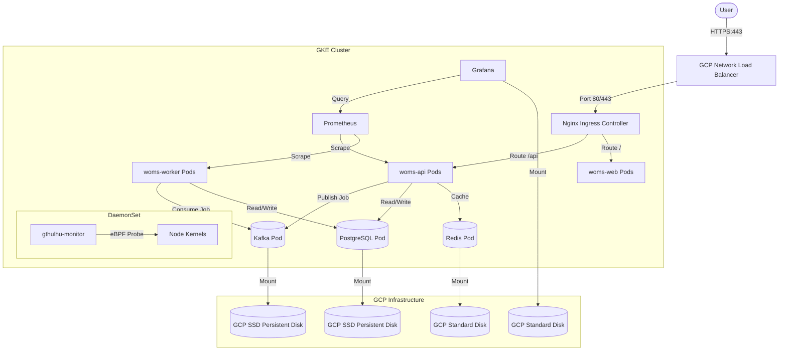

# WOMS GCP 移轉與部署計劃

[繁體中文](file:///c:/Users/Alen%20Chen/Desktop/WMOS/WOMS/Plan.zh-TW.md) | [English](file:///c:/Users/Alen%20Chen/Desktop/WMOS/WOMS/Plan.md)

本文件提供了將晶圓訂單管理與排程系統 (WOMS) 從本地開發/測試環境移轉至 **Google Cloud Platform (GCP)** 的完整計劃，且每月預算嚴格控制在 **$200 美元**以內。

為了滿足所有架構約束——特別是啟用基於 eBPF 的 `gthulhu` 監控、配置負載平衡器 (Load Balancer)、強制執行 HTTPS，並確保持久、高可靠性的資料儲存——系統將部署在 **GKE Standard** 叢集上，並利用混合節點池 (Standard + Spot 實例) 配置。

---

## 1. 現有 Helm 部署分析

目前，WOMS 被打包為一個雨傘 Helm chart (`deploy/helm/woms`)，其中包含以下核心工作負載與本地配置資源：

1. **無狀態工作負載 (Stateless Workloads)**：
   - `woms-web` (前端)：2 個副本 (Requests: 50m CPU, 64Mi RAM；Limits: 200m CPU, 128Mi RAM)。
   - `woms-api` (Go API)：2 個副本 (Requests: 100m CPU, 128Mi RAM；Limits: 500m CPU, 512Mi RAM)。
   - `woms-worker` (Go 排程 Worker)：透過 KEDA 進行 1 至 10 個副本的動態伸縮 (Requests: 100m CPU, 128Mi RAM；Limits: 1000m CPU, 512Mi RAM)。
2. **有狀態工作負載 (Stateful Workloads)** (透過 Bitnami Helm charts 依賴)：
   - `postgresql`：1 個副本 (Requests: 100m CPU, 256Mi RAM；Limits: 500m CPU, 512Mi RAM)。
   - `redis`：1 個副本 (Requests: 50m CPU, 128Mi RAM；Limits: 250m CPU, 256Mi RAM)。
   - `kafka`：1 個副本 (Requests: 100m CPU, 512Mi RAM；Limits: 1000m CPU, 1Gi RAM)。
3. **監控堆疊 (Monitoring Stack)**：
   - `prometheus`：1 個副本 (抓取 API 與 Worker 的指標)。
   - `grafana`：1 個副本 (Requests: 50m CPU, 128Mi RAM；Limits: 250m CPU, 256Mi RAM)。
4. **Ingress 與自動伸縮**：
   - Nginx Ingress Controller (控制路由)。
   - KEDA (Kubernetes Event-driven Autoscaling)，基於 Kafka 延遲 (lag) 與 CPU 觸發。
5. **Gthulhu (BPF 監控)**：
   - 目前在本地 values 中被停用的 DaemonSet，但在生產環境中需要啟用。它將 BPF 探針部署到節點核心以監控上下文切換與等待時間。

---

## 2. 目標 GCP 架構



### 2.1 組件映射與配置
* **GKE Standard 叢集**：選擇 Standard 叢集而非 Autopilot。GKE Autopilot 會封鎖特權容器 (`securityContext.privileged: true`)，並限制掛載 `/sys/kernel/debug` 或在主機節點上載入自訂 BPF 程式，這會使 `gthulhu` 的 eBPF 探針完全無法運作。
* **混合節點池 (Hybrid Node Pools)**：
  * **Pool A (有狀態 - 1x 標準節點)**：使用 1x 非搶佔式 `e2-standard-2` (2 vCPUs, 8 GB RAM) VM。該節點被設定污點 (tainted) 專供有狀態工作負載使用。PostgreSQL、Kafka 和 Redis 將透過 `nodeSelector` / `tolerations` 明確固定於此，以防止節點被搶佔時資料丟失或叢集不穩定。
  * **Pool B (無狀態 - 2x Spot 節點)**：使用 2x Spot `e2-standard-2` (2 vCPUs, 8 GB RAM) VM。此節點池運行 `api`、`web`、`worker`、`prometheus`、`grafana`、KEDA 運算子及 Nginx Ingress。若有節點被搶佔，Pod 將無縫重新調度至其餘 Spot 節點上。
* **資料一致性與高可靠性**：
  * 持久化儲存依賴於 Google Cloud **Persistent Disks (PD)**。由於資料庫和 Broker Pod 是有狀態的，其資料會被寫入獨立於 VM 節點生命週期的專用 PD 中。
  * SSD Persistent Disks (`pd-ssd` 或 `pd-balanced`) 用於 PostgreSQL 和 Kafka，以確保高寫入吞吐量和穩定性。
  * Standard Persistent Disks (`pd-standard`) 用於 Redis 和 Grafana。
  * *備份策略*：配置 GCP VM/磁碟快照排程，以對 PostgreSQL 和 Kafka 磁碟區進行每晚自動備份。
* **負載平衡器與 HTTPS**：
  * Nginx Ingress Service 將透過 `type: LoadBalancer` 暴露。在 GKE 中，這會自動啟用一個 Google Cloud Network Load Balancer (直通式 L4 外部負載平衡器)。
  * HTTPS 終端由 Nginx Ingress 處理。叢集中將安裝 **Cert-Manager**，以透過 Let's Encrypt 自動申請並更新 SSL 憑證。

---

## 3. 預算估算表 (us-central1 區域)

為了確保部署費用嚴格控制在每月 $200 美元以下，我們善用了 GKE 的免費額度以及 GCP 的 Spot VM 折扣。

| 元件 | GCP 資源 | 計費細節 | 預估月租費 (美元) |
| :--- | :--- | :--- | :--- |
| **叢集管理** | GKE Standard 管理費 | $0.10/小時 ($73.00/月) - 由 GKE 免費額度全額抵消 | **$0.00** |
| **有狀態節點** | 1x `e2-standard-2` (一般) | 2 vCPUs, 8 GB RAM (執行 PostgreSQL, Redis, Kafka, Gthulhu) | **$48.91** |
| **無狀態節點池**| 2x `e2-standard-2` (Spot) | 每個 2 vCPUs, 8 GB RAM (執行 Web, API, Worker, KEDA, Prometheus) | **$29.34** |
| **持久化儲存** | GCP SSD & Standard PD | 2x 10GB SSD PD (Postgres, Kafka) + 2x 5GB Standard PD (Redis, Grafana) | **$3.80** |
| **負載平衡器** | L4 外部 TCP/UDP 負載平衡 | 透過 Nginx Ingress Service 自動建立 | **$18.00** |
| **外網出口閘道**| Cloud NAT Gateway | 提供私有節點存取 Docker Hub 與外部 API 所需的出境連線 | **$1.50** |
| **容器映像庫** | Artifact Registry | 儲存建置好的映像檔 (~2GB) | **$0.20** |
| **網路流量費** | Outbound 流量費 | 測試環境對外流量 (預估 ~40GB/月) | **$5.00** |
| **總計預估月租費**| | | **~$106.75 / 月** |

> [!NOTE]
> GKE Standard 收取每小時 0.10 美元的固定叢集管理費，但 Google 會對每個計費帳戶自動套用 **每月 $74.40 美元的免費額度**，這使得單個叢集的管理費用實際上為免費 ($0.00)。
> 若排程 Worker 在 Kafka 佇列延遲高峰期動態擴展至最大 10 個副本，GKE 的叢集自動伸縮器 (Cluster Autoscaler) 將會臨時啟動額外的 Spot 節點。每週臨時擴展 2 個 Spot 節點 10 小時，僅會增加約 $1.60 美元的月租費，預算依然安全保持在 $200 美元以下。

---

## 4. 移轉與部署步驟

### 步驟 1：準備工作與本地配置
1. 在本地或透過 GitHub Actions 建置生產環境 Docker 映像檔：
   - API：`docker.io/d11nn/woms-api:<tag>`
   - Worker：`docker.io/d11nn/woms-scheduler-worker:<tag>`
   - Web：`docker.io/d11nn/woms-web:<tag>`
2. 將映像檔推送到 Docker Hub (或 GCP Artifact Registry)。

### 步驟 2：設定 GCP 網路與安全
執行以下 GCP CLI 命令配置 VPC、私有子網以及 Cloud NAT (使 GKE 節點安全隔離但仍能拉取外部映像檔)：

```bash
# 1. 建立自訂 VPC 網路
gcloud compute networks create woms-vpc --subnet-mode=custom

# 2. 建立私有子網路
gcloud compute networks subnets create woms-gke-subnet \
    --network=woms-vpc \
    --region=us-central1 \
    --range=10.10.0.0/20 \
    --enable-private-ip-google-access

# 3. 建立 Cloud Router (Cloud NAT 的前置條件)
gcloud compute routers create woms-router \
    --network=woms-vpc \
    --region=us-central1

# 4. 建立 Cloud NAT 配置
gcloud compute routers nats create woms-nat \
    --router=woms-router \
    --region=us-central1 \
    --auto-allocate-nat-external-ips \
    --nat-custom-subnet-ip-ranges=woms-gke-subnet
```

### 步驟 3：建立 GKE Standard 叢集
部署叢集並為有狀態服務建立一個預設套用污點 (tainted) 的節點池，接著加入無狀態的 Spot 節點池：

```bash
# 1. 建立包含標準有狀態節點池的叢集
gcloud container clusters create woms-cluster \
    --region=us-central1 \
    --node-locations=us-central1-a \
    --num-nodes=1 \
    --machine-type=e2-standard-2 \
    --network=woms-vpc \
    --subnetwork=woms-gke-subnet \
    --enable-ip-alias \
    --enable-private-nodes \
    --master-ipv4-cidr=172.16.0.0/28 \
    --node-taints=workload=stateful:NoSchedule \
    --node-labels=workload=stateful

# 2. 為無狀態服務加入 Spot 節點池
gcloud container node-pools create stateless-pool \
    --cluster=woms-cluster \
    --region=us-central1 \
    --num-nodes=2 \
    --machine-type=e2-standard-2 \
    --spot \
    --enable-autoscaling --min-nodes=1 --max-nodes=5 \
    --node-labels=workload=stateless
```

### 步驟 4：安裝系統依賴項 (Ingress 與 Cert-Manager)
連接至叢集並透過 Helm 安裝 Nginx Ingress Controller 和 Cert-Manager：

```bash
# 取得叢集憑證
gcloud container clusters get-credentials woms-cluster --region=us-central1

# 新增 helm 映像檔倉庫
helm repo add ingress-nginx https://kubernetes.github.io/ingress-nginx
helm repo add jetstack https://charts.jetstack.io
helm repo update

# 在無狀態節點池上安裝 Ingress-Nginx
helm upgrade --install ingress-nginx ingress-nginx/ingress-nginx \
    --namespace ingress-nginx --create-namespace \
    --set controller.nodeSelector.workload=stateless

# 安裝 Cert-Manager
helm upgrade --install cert-manager jetstack/cert-manager \
    --namespace cert-manager --create-namespace \
    --set installCRDs=true \
    --set nodeSelector.workload=stateless
```

### 步驟 5：設定 Storage Classes 與 Let's Encrypt 發行者
建立儲存設定檔 `gcp-storageclasses.yaml` 來註冊 GCP 的持久化硬碟：

```yaml
apiVersion: storage.k8s.io/v1
kind: StorageClass
metadata:
  name: pd-ssd
provisioner: pd.csi.storage.gke.io
volumeBindingMode: WaitForFirstConsumer
parameters:
  type: pd-ssd
---
apiVersion: storage.k8s.io/v1
kind: StorageClass
metadata:
  name: pd-standard
provisioner: pd.csi.storage.gke.io
volumeBindingMode: WaitForFirstConsumer
parameters:
  type: pd-standard
```
套用設定：`kubectl apply -f gcp-storageclasses.yaml`

建立 Let's Encrypt ClusterIssuer 設定檔 `cluster-issuer.yaml` 來申請 SSL 憑證：

```yaml
apiVersion: cert-manager.io/v1
kind: ClusterIssuer
metadata:
  name: letsencrypt-prod
spec:
  acme:
    server: https://acme-v02.api.letsencrypt.org/directory
    email: admin@woms.company.com  # 請修改為系統管理員電子信箱
    privateKeySecretRef:
      name: letsencrypt-prod
    solvers:
    - http01:
        ingress:
          class: nginx
```
套用設定：`kubectl apply -f cluster-issuer.yaml`

### 步驟 6：部署 WOMS Helm Chart
要在 GKE Standard 上部署 WOMS，我們必須自訂 `values.yaml` 以將工作負載正確對應至對應的節點池與持久化儲存。準備一個新的 `values-gcp.yaml` 檔案：

```yaml
global:
  imagePullPolicy: IfNotPresent

imageRegistry: docker.io/d11nn

api:
  replicaCount: 2
  image:
    tag: v0.1.41
  resources:
    requests:
      cpu: 100m
      memory: 128Mi
    limits:
      cpu: 500m
      memory: 512Mi
  nodeSelector:
    workload: stateless

worker:
  replicaCount: 1
  image:
    tag: v0.1.41
  resources:
    requests:
      cpu: 100m
      memory: 128Mi
    limits:
      cpu: 1000m
      memory: 512Mi
  nodeSelector:
    workload: stateless

web:
  replicaCount: 2
  image:
    tag: v0.1.41
  resources:
    requests:
      cpu: 50m
      memory: 64Mi
    limits:
      cpu: 200m
      memory: 128Mi
  nodeSelector:
    workload: stateless

ingress:
  enabled: true
  className: nginx
  host: woms.gcp.yourcompany.com   # 請將您的 DNS A 紀錄指向 Ingress 負載平衡器的外網 IP
  annotations:
    cert-manager.io/cluster-issuer: letsencrypt-prod
  tls:
    enabled: true
    secretName: woms-tls-prod

keda:
  enabled: true
  minReplicaCount: 1
  maxReplicaCount: 10
  # KEDA 運算子於無狀態節點池執行
  operator:
    nodeSelector:
      workload: stateless

gthulhu:
  enabled: true  # 依照需求啟用！
  scheduler:
    image:
      tag: "v0.1.0"
  # 將監控 DaemonSet 部署到所有節點，以抓取 eBPF 核心排程遙測指標
  daemonset:
    tolerations:
      - key: "workload"
        operator: "Equal"
        value: "stateful"
        effect: "NoSchedule"

postgresql:
  enabled: true
  fullnameOverride: postgres
  global:
    storageClass: pd-ssd  # 掛載高可靠性 SSD PD
  primary:
    persistence:
      size: 10Gi
    resources:
      requests:
        cpu: 100m
        memory: 256Mi
      limits:
        cpu: 500m
        memory: 512Mi
    nodeSelector:
      workload: stateful
    tolerations:
      - key: "workload"
        operator: "Equal"
        value: "stateful"
        effect: "NoSchedule"

redis:
  enabled: true
  fullnameOverride: redis
  master:
    persistence:
      storageClass: pd-standard  # 掛載標準 PD
      size: 5Gi
    resources:
      requests:
        cpu: 50m
        memory: 128Mi
      limits:
        cpu: 250m
        memory: 256Mi
    nodeSelector:
      workload: stateful
    tolerations:
      - key: "workload"
        operator: "Equal"
        value: "stateful"
        effect: "NoSchedule"

kafka:
  enabled: true
  fullnameOverride: kafka
  controller:
    replicaCount: 1
    persistence:
      storageClass: pd-ssd  # 掛載 SSD PD 作為 Broker 日誌儲存
      size: 10Gi
    resources:
      requests:
        cpu: 100m
        memory: 512Mi
      limits:
        cpu: 1000m
        memory: 1Gi
    nodeSelector:
      workload: stateful
    tolerations:
      - key: "workload"
        operator: "Equal"
        value: "stateful"
        effect: "NoSchedule"
```

套用 Helm 部署升級：
```bash
helm upgrade --install woms ./deploy/helm/woms \
    --namespace woms --create-namespace \
    --values ./values-gcp.yaml --dependency-update
```

---

## 5. 驗證計劃

### 5.1 靜態驗證
使用 GCP 設定執行 `helm template`，以確保所有資源渲染並轉換成正確的配置：
```bash
helm template woms ./deploy/helm/woms --values ./values-gcp.yaml --namespace woms
```

### 5.2 實際部署驗證
1. **工作負載與 Pod 分配**：
   確認資料庫與 Broker Pod 確實部署於標準節點 (stateful)，且應用程式與 Worker Pod 確實執行於 Spot 虛擬機器 (stateless)：
   ```bash
   kubectl get pods -n woms -o wide
   ```
2. **Ingress IP 與 DNS 解析**：
   取得 GCP 負載平衡器分配的外網 IP 地址：
   ```bash
   kubectl get svc -n ingress-nginx
   ```
   請在您的 DNS 託管服務商中，將 `woms.gcp.yourcompany.com` 指向此外部 IP。
3. **SSL 憑證簽發**：
   確認 `cert-manager` 已成功建立憑證密鑰並通過挑戰認證：
   ```bash
   kubectl get certificate -n woms
   ```
4. **驗證指令碼**：
   執行 WOMS 的 Kubernetes 資源驗證測試套件：
   ```bash
   NAMESPACE=woms ./scripts/verify-k8s.sh
   ```
5. **Gthulhu 指標抓取**：
   檢查 `gthulhu-monitor` Pod 是否在所有節點上順利啟動，並正常輸出 eBPF 上下文切換的追蹤遙測日誌：
   ```bash
   kubectl logs -n woms -l app.kubernetes.io/name=gthulhu
   ```
